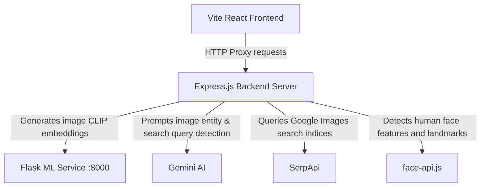

# AegisGuard - Digital Asset Protection System

AegisGuard is a state-of-the-art intellectual property defense platform designed to protect visual creators and companies. The platform detects duplicate creations, modifications, and copyright infringements by utilizing deep learning representations (CLIP), facial embedding distance (face-api.js), and generative query design (Gemini AI).

---

## System Architecture



### Modules
1. **Frontend (Vite / React / CSS)**: A premium glassmorphism dark-mode UI for submitting targets, browsing repository matching cards, and inspecting risk scan levels.
2. **Backend (Node.js / Express)**: Orchestrates similarity mathematics, file uploads via multer, static file delivery, face-api model evaluation, SerpApi downloads, and Gemini analysis.
3. **ML Service (Python / Flask)**: Generates 512-dimension visual representations using OpenAI's **ViT-B/32 CLIP model** via PyTorch.

---

## Installation & Setup

### 1. Prerequisites
- [Node.js](https://nodejs.org/) (v16+)
- [Python 3.8+](https://www.python.org/) (with `pip`)

### 2. Environment Configuration
Create a `.env` file in the project's root folder:
```ini
GEMINI_API_KEY=your_gemini_key_here
SERP_API_KEY=your_serpapi_key_here
```

### 3. ML Service Setup
Navigate to `/ml-service`:
```bash
# Set up Python virtual environment
python -m venv venv
source venv/bin/activate  # On Windows: venv\Scripts\activate

# Install PyTorch, PIL, Flask, and OpenAI CLIP
pip install torch torchvision --index-url https://download.pytorch.org/whl/cpu
pip install flask pillow git+https://github.com/openai/CLIP.git
```
Start the Python backend service:
```bash
python app.py
# Running on http://localhost:8000
```

### 4. Express Backend Setup
Navigate to `/backend`:
```bash
npm install
npm start
# Running on http://localhost:5000
```

### 5. React Frontend Setup
Navigate to `/frontend`:
```bash
npm install
npm run dev
# Running on http://localhost:3000
```

---

## Main Core Features

### 1. Image Similarity
Submit exactly two images to compare. The platform generates CLIP vector embeddings for both and calculates their Cosine Similarity.
- **Low Risk**: Composition and contents differ significantly.
- **Medium Risk**: Common environments, styles, or patterns.
- **High Risk**: Direct copy, compression changes, or minor overlays.

### 2. Catalog Matcher
Scan single target images against the database repository (`/backend/dataset/`). Results display matching candidates ranked by similarity percentage.

### 3. Web Piracy Scanner (Global Sweep)
A multi-layered sweep for high-risk assets:
- **Gemini AI**: Detects the subject entity and creates target search queries.
- **SerpApi**: Fetches matched public image links matching Gemini query results.
- **Face API + CLIP**: Performs landmark searches and CLIP similarity scans on downloaded targets to evaluate copyright breach status.
